# insp1re-pr1-proof

Proof shots for insp1re. This is not the app.

Browse by day, then feature.

## 2026-09-01

### Today

### Perform

Hosted Flutter web chrome for PR https://github.com/Harding-Ventures-LLC/insp1re/pull/2. Layout is `2026-09-01/perform/`.

## 2026-09-02

### Mind

Hosted Flutter web chrome for PR https://github.com/Harding-Ventures-LLC/insp1re/pull/3. Layout is `2026-09-02/mind/`.

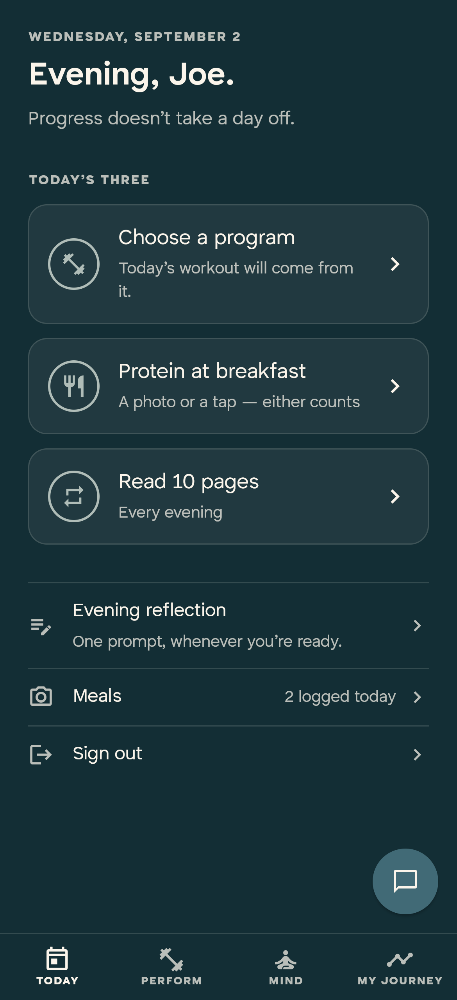

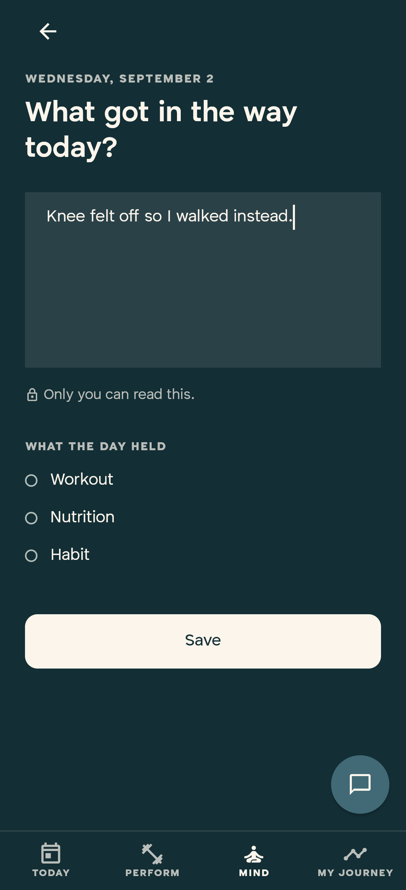

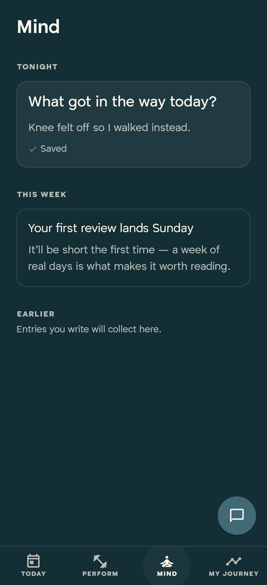

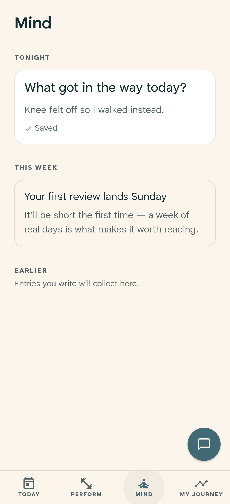

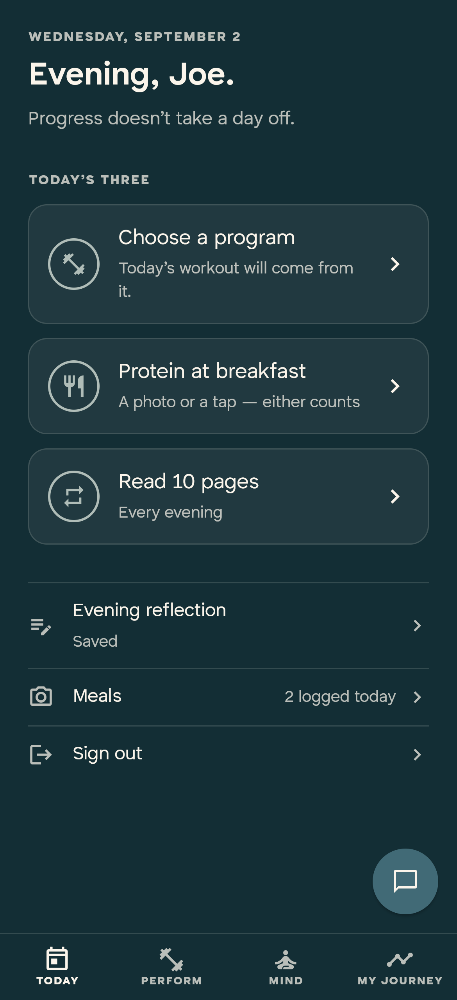

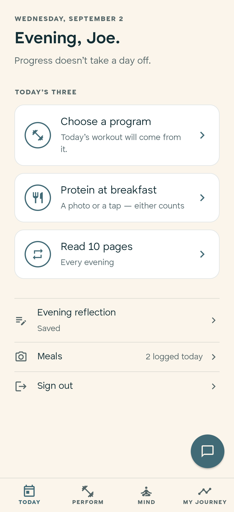

### Journey

Hosted Flutter web chrome for PR https://github.com/Harding-Ventures-LLC/insp1re/pull/4. Layout is `2026-09-02/journey/`.

Pending Today habit follows the active habit. Completing it lights Today and the run on My Journey is derived from `day_intentions` (1 in a row). Light ground is the long-press on the Today greeting.

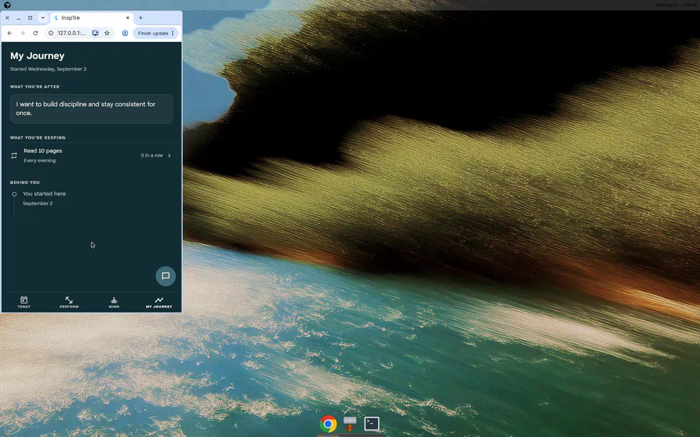

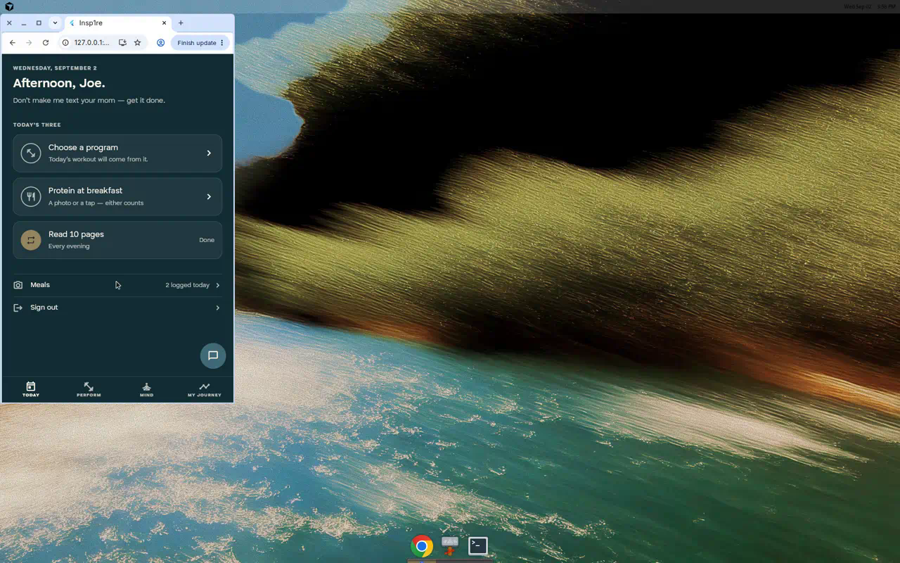

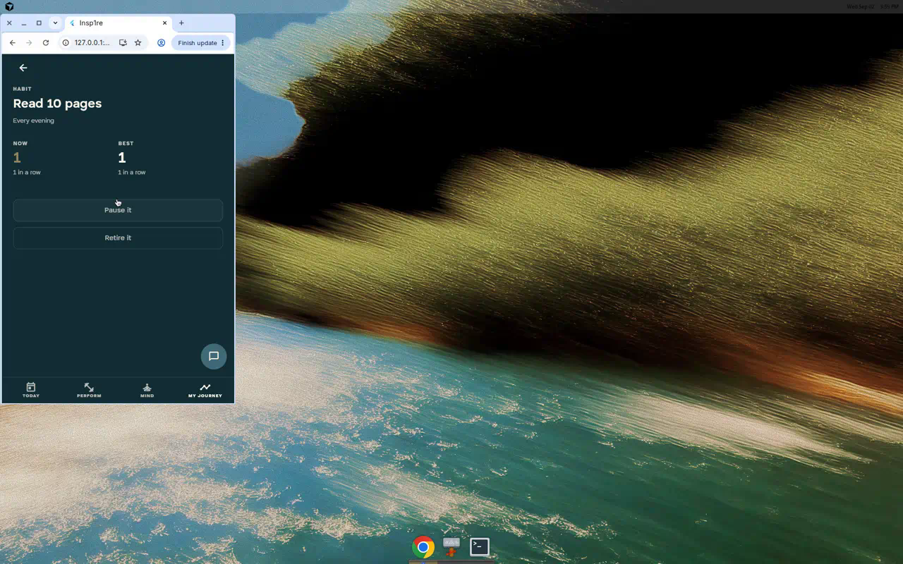

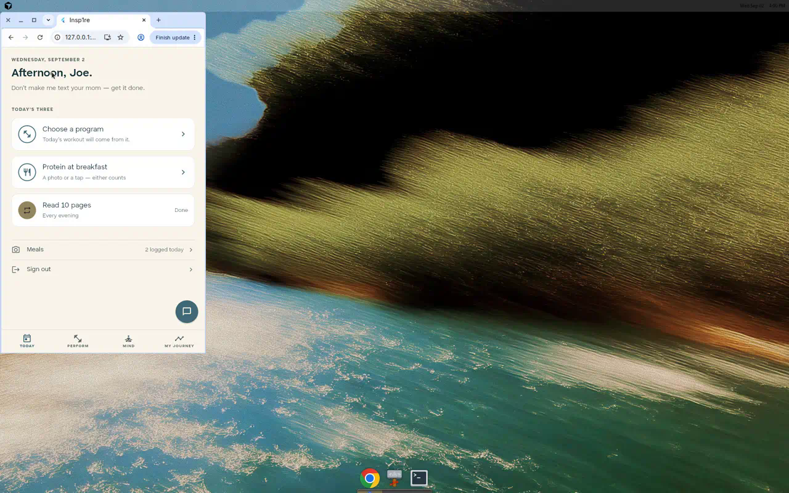

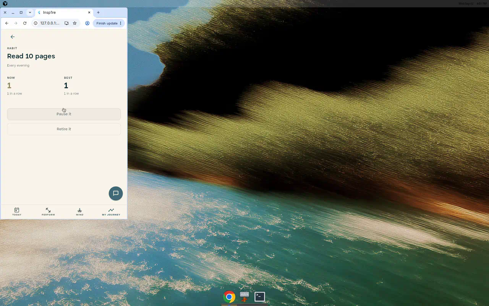
